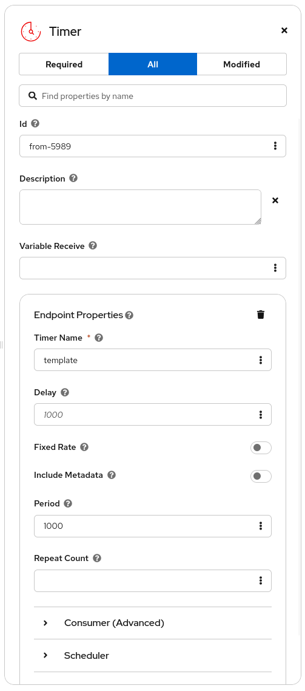

<h1 align="center">
  <a href="https://kaoto.io/"></a>
</h1>

<p align=center>
  <a href="https://github.com/KaotoIO/kaoto/blob/main/LICENSE"></a>
  <a href="https://www.youtube.com/@KaotoIO"></a>
  <a href="https://camel.zulipchat.com/#narrow/stream/441302-kaoto"></a>
  <a href="https://kaoto.io"></a>
</p><br/>

<h2 align="center">Kaoto - The Integration Designer for <a href="https://camel.apache.org">Apache Camel</a></h2>

<p align="center">
  <a style="font-weight: bold" href="https://kaoto.io/docs/installation">Documentation</a> |
  <a style="font-weight: bold" href="https://kaoto.io/workshop/">Workshops</a> |
  <a style="font-weight: bold" href="https://kaoto.io/contribute/">Contribute</a> |
  <a style="font-weight: bold" href="https://camel.zulipchat.com/#narrow/stream/441302-kaoto">Chat</a>
</p>

<p align="center">
  
</p>

# Kaoto forms

Kaoto forms are a library of reusable components that can be used to build forms in the Kaoto UI. They are designed to be flexible and easy to use, adapted to Apache Camel component schemas, allowing developers to create forms that can be used in different contexts.

# Getting started

```jsx
import { KaotoForm } from '@kaoto/forms';

const schema = {
  type: 'object',
  properties: {
    name: {
      type: 'string',
      title: 'Name',
      description: 'The name of the integration',
    },
    description: {
      type: 'string',
      title: 'Description',
      description: 'A brief description of the integration',
    },
    // Add more properties as needed
  },
};

const model = {
  name: 'My Integration',
  description: 'This is a sample integration',
  // Add more properties as needed
};

const handleOnChangeIndividualProp = (path: string, value: unknown) => {
  console.log(`Property ${prop} changed to ${value}`);
  // Handle the change event as needed
};

const onChange = (value: unknown) => {
  console.log('Form changed:', value);
  // Handle the form change event as needed
};

<KaotoForm
  schema={schema}
  model={model}
  onChangeProp={handleOnChangeIndividualProp}
  onChange={onChange}
/>
```

# Screenshots

<p align="center">
  
</p>
